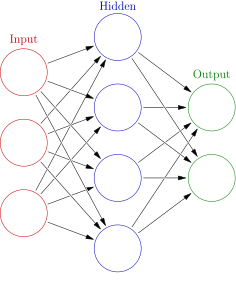

Academic year: 2021-2022
----------------

# Practical Work 2

### Goals
* Tensorflow
* Analyses of texts
* LSTM models

## Exercise 2.1

Upgrade tensorflow to the latest version.

```
              !pip install tensorflow --upgrade              
```

See the version installed on your machine

```
              import tensorflow as tf
              print(tf.__version__)              
```

For example, you may get the following value

```
              2.3.1             
```



In order to create the above neural network model, you can test the
following code.

```
 from tensorflow.keras.models import Sequential
 from tensorflow.keras.layers import Conv2D
 from tensorflow.keras.layers import MaxPool2D
 from tensorflow.keras.layers import Flatten
 from tensorflow.keras.layers import Dense
 
 # Creating a sequential model
 model = Sequential()
 model.add(Dense(4, activation='relu', input_shape=(3,)))
 model.add(Dense(units=2, activation='softmax'))

 # compiling the model
 model.compile(loss='mse', optimizer='sgd', metrics=['accuracy'])
```

In the above model, we use Stochastic gradient descent optimizer and
mean square error as the loss calculator.

In the code below, we use a SGD optimizer using a learning rate of 0.01.

```
 from tensorflow.keras.models import Sequential
 from tensorflow.keras.layers import Conv2D
 from tensorflow.keras.layers import MaxPool2D
 from tensorflow.keras.layers import Flatten
 from tensorflow.keras.layers import Dense
 from tensorflow.keras.optimizers import SGD

 # Creating a sequential model
 model = Sequential() 
 model.add(Dense(4, activation='relu', input_shape=(3,)))
 model.add(Dense(units=2, activation='softmax'))

 # compiling the model
 sgd = SGD(lr=0.01)
 model.compile(loss='mean_squared_error', optimizer=sgd,metrics=['accuracy'])
```

Observe the different layers. Choose a dataset from Tensorflow:
<https://www.tensorflow.org/datasets/catalog/overview> and build a model
for your hypothesis. You can also make use of the existing models.

## Exercise 2.2

Download an HTML page from the internet (e.g.,
<https://en.wikipedia.org/wiki/Paris>). Choose a long paragraph from the
page and perform the following operations

1.  Stemmming
2.  PoS Tagging
3.  Lemmatization
4.  Morphological analysis
5.  Named Entity Recognition
6.  Word embedding using Word2Vec models (CPOW and Skip-gram)

You can use one or more of the following packages, wherever possible. If
you are using more than two packages, also write a small comparative
report on your results.

1.  nltk
2.  spaCy
3.  gensim
4.  Tensorflow

## Exercise 2.3

### LSTM models

**Time Series Prediction with LSTM models**: Please check and run the
following code
<https://machinelearningmastery.com/time-series-prediction-lstm-recurrent-neural-networks-python-keras/>

Observe how sequences are generated in these examples.

## Submission

-   Rename your notebook as Name1\_Name2\_\[Name3\].ipynb, where Name1,
    Name2 are your names.
-   Submit your notebook online.
-   Please **don\'t** submit your JSON, TSV and CSV files.

